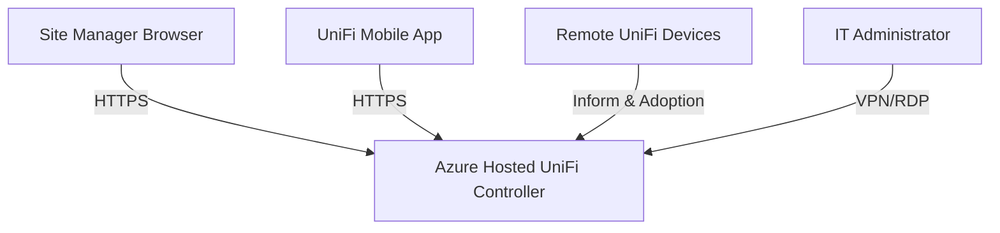

# Azure-Hosted UniFi Network Monitoring Solution

---

## Overview
This project demonstrates the deployment and migration of a centralised UniFi Network Application monitoring environment to a Microsoft Azure Virtual Machine.

The objective was to bring a third-party hosted monitoring solution in-house to reduce operational costs, improve administrative control, and centralise the management of multiple remote client sites.

---

# The Problem

The company was paying approximately **R1 800 per month** to a third-party provider for hosted UniFi Network Application services.

In addition to the ongoing operational cost, absence of handover and limited access to existing controller environment resulting in:
- No administrative access to the existing controller
- Limited visibility into the deployed infrastructure
- Increased operational risk
- Difficulty onboarding and managing existing client environments

This created a significant migration challenge, as all existing UniFi devices needed to be rediscovered, reset, and manually adopted into the new controller environment.

---

# The Solution

I deployed a new centralised UniFi Network Application environment on a Microsoft Azure Virtual Machine using existing Microsoft partner Azure credits.

The migration:
- Eliminated the recurring third-party hosting expense
- Restored full administrative control
- Centralised management of all client sites
- Improved scalability and long-term maintainability
- Allowed secure remote management from both desktop and mobile platforms

---

# Technologies Used

- Microsoft Azure Virtual Machines
- Azure Virtual Networking (VNet, Subnets, NSGs)
- UniFi Network Application
- SSH Device Management
- UniFi Layer 3 Discovery
- DHCP Option 43 (Vendor)
- Windows Server RRAS (Routing and Remote Access Service)
- Remote Desktop Services (RDP)
- SSTP VPN Connectivity

---

# Implementation & Architecture

## Azure VM Deployment
- Provisioned and configured a cost-effective Azure Virtual Machine for hosting the UniFi Network Application.
- Configured Azure networking, firewall policies, and Network Security Group (NSG) rules to securely expose only the required services.
- Implemented secure remote administration access using RRAS VPN services.

## VM Sizing Justification
The UniFi Network Application has relatively modest system requirements for small-to-medium environments.

The selected Azure VM provided:
- 2 vCPUs
- 4 GB RAM
- Burstable performance
- Low operational overhead
- Sufficient resources for multiple remote sites

This allowed the environment to remain cost-effective while maintaining stable controller performance.

## UniFi Migration Process
Due to absence of handover and limited access to existing controller environment:
- DHCP Option 43 was utilised for auto-discovery and adoption to the new controller
- Existing UniFi devices had to be manually rediscovered if DHCP option 43 failed 
- SSH was used to factory reset inaccessible devices
- UniFi Layer 2 Discovery tools were used to identify devices on-site
- Devices were manually adopted into the new centralised controller
- Existing configurations were recreated to ensure a seamless migration experience for clients

The migration was completed successfully with no major downtime or service interruption.

---

# UniFi Access Architecture

The following diagram illustrates how UniFi devices and administrators securely interact with the Azure-hosted UniFi controller.

---

# Skills Demonstrated

- Cloud Infrastructure Deployment
- Azure Virtual Machine Administration
- Network Security & Firewall Configuration
- VPN & Secure Remote Access
- UniFi Controller Migration
- Infrastructure Troubleshooting
- Device Recovery & Re-Adoption
- Systems Administration
- Centralised Network Monitoring
- Cost Optimisation
- Technical Documentation

---

# Outcome / Business Impact

The project successfully delivered a resilient and scalable cloud-hosted UniFi Network Application solution capable of managing multiple remote client sites from a single centralised environment.

Key outcomes included:
- Reduction of approximately **R1 800 per month** in recurring operational costs
- Restoration of full administrative control
- Improved remote management capabilities
- Centralised visibility across all client sites
- Improved long-term scalability and maintainability

The solution continues to provide stable and secure centralised network management while leveraging existing company cloud resources effectively.

---

# Lessons Learned

- The importance of proper infrastructure documentation and credential management
- Real-world challenges involved in migrating UniFi environments without controller access
- Benefits of centralised cloud-hosted network management
- Importance of secure remote administration practices
- Practical implementation of Azure networking and remote access services

---

# Project Status

Successfully deployed and actively used for centralised multi-site management.
